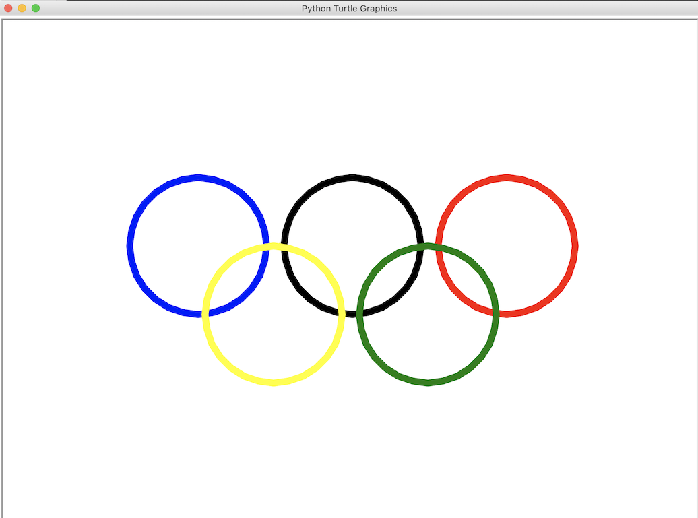

# Unit 1 Fundamentals of Programming in Python

----------

The topics explored in this unit are:

- [Module 01](#module-01)
  * [Python Basics](#python-basics)
  * [Turtle](#turtle)
- [Module 02](#module-02)
  * [Calculation](#calculation)
- [Module 03](#module-03)
  * [Creating A Simple Game](#creating-a-simple-game)
  * [Password Generator](#password-generator)
- [Module 04](#module-04)
  * [Collatz Sequence](#collatz-sequence)
  * [Comma Code](#comma-code)
  * [Character Picture Grid](#character-picture-grid)
- [Module 05](#module-05)
  * [Functions](#functions)
  * [Encryption/Decryption](#encryption/decryption)
- [Module 06](#module-06)
  * [Strings and Exception Handling](#strings-and-exception-handling)
  * [Password Manager Program](#password-manager-program)

## Module 01
### Python Basics

----------

I began with learning the basics of the Python language. First, I created a variable, printed it, then changed its value and had the new value printed. Then, I created a file to show how quotation marks are printed to the screen. Next, I stored a number in a variable and converted the variable to a string so that I can use the variable to create a string message. Lastly, I used the len() function to count the number of characters that are in a string.

FILE GOES HERE.

FILE GOES HERE.

FILE GOES HERE.

FILE GOES HERE.

### Turtle

----------

I created the following program to explore the turtle graphics system. The codes I used moved a pen around the screen and change the pen's color and width to draw the image seen above.

FILE GOES HERE.

## Module 02
### Calculation

----------

The goal here was to use Python's math operators to estimate the number of trees in Sacramento.

FILE GOES HERE.

## Module 03
### Creating A Simple Game

----------

This simple game of Rock - Paper - Scissors, is a good example of working with conditionals. The entire program relies on evaluating if a condition is met then do this else if the condition is not met then do something else. I decided to take the progaram a step further and code it to that popular game of Rock - Paper - Scissors - Lizard - Spock.

FILE GOES HERE.

### Password Generator

----------

The password generator is a good example of how random items from a list can be chosen by the computer. Since this is a *password* generating program, it was also useful to lean how to use the .replace(str1, str2) and .capitalize() methods to generate more secure passwords. As a challenge project, I made a program that gives the computer 60 seconds to guess what the password is and displays the number of guesses after a user inputs a 4 character password composed only of lower case letters.

FILE GOES HERE.

FILE GOES HERE.

## Module 04
### Collatz Sequence

----------

This program is an example of how to define a function and how to use the  **_try_** and **_except_** statements to validate the input. The collatz(number) function divides an even input integer by 2 or multiplies and odd input integer by 3 and adds 1. The program calls on this function until the the num variable is equal to 1.

FILE GOES HERE.

### Comma Code

----------

A function that takes a list value as an argument and returns a string with all the items separated by a comma and a space, with 'and' inserted before the last item. This is a good example of how to type a list once and call on the values without typing each value over again in the code.

FILE GOES HERE.

### Character Picture Grid

----------

This function prints an ASCII image. The image is created by printing the values of each list that are stored in a list. This project was a good example of getting specific values from a specific index in a list. To print my second image, I printed the image on paper and sketched a grid of each character that was needed for the image. I then used my grid to enter each value of each list and position the lists in the main list so that when the function was called the characters would print the resulting ASCII image.

FILE GOES HERE.

## Module 05
### Functions

----------

FILE GOES HERE.

### Encryption/Decryption

----------

FILE GOES HERE.

## Module 06
#### Strings and Exception Handling

----------

FILE GOES HERE.

### Password Manager Program

----------

FILE GOES HERE.

#### Course Units

----------

1. [**Fundamentals of Programming in Python**](./fundamentals_of_programming.md)
2. [Internet of Things (IoT)](./internet_of_things.md)
3. [Secure Scripting](./secure_scripting.md)
4. [Data Analytics](./data_analytics.md)
5. [Python Hackathon](./python_hackathon.md)

[About Me](./README.md)
