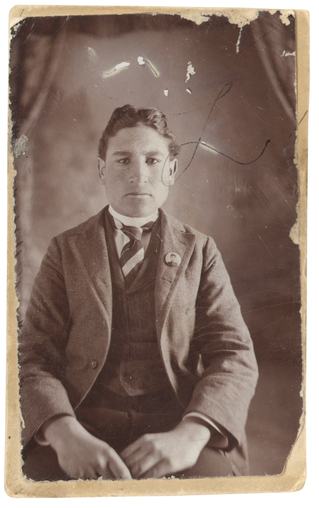
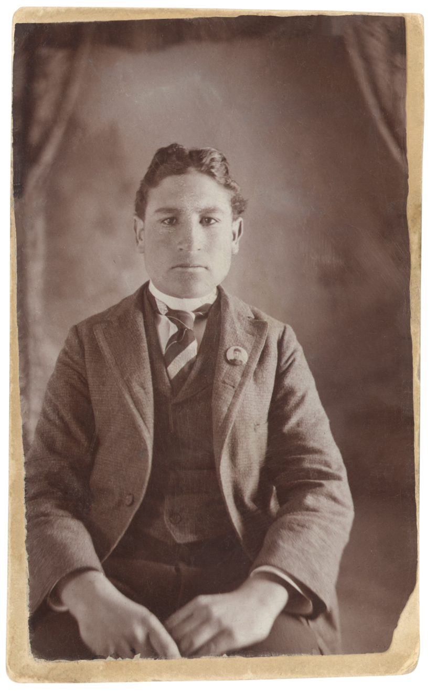
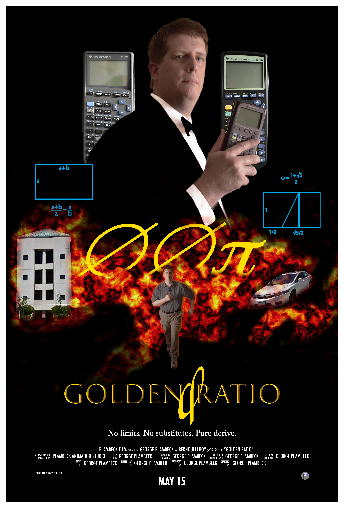

# Gallery

----------

Welcome to my gallery. Here, I have samples of projects I did in 

- [Illustrator](#illustrator)
- [Phototshop](#photoshop)
- [InDesign](#indesign)
- [Maya](#maya)

I’ve organized my portfolio like a table of contents in a book. Each project is sectioned by the programs used to create each of the artworks. Each program used for the projects are linked to their specific section of the page. The reason for this order is to make navigating each page and the entire portfolio site user friendly.

I have chosen these particular pieces to demonstrate my skills as a graphic artist and an imaginative story teller. Each of these pieces represents how I started with learning the basics and how the different codes work and then advancing by applying what I have learned to create useful programs. My goals were to improve the skills I had already taught myself and to understand the language better. I have successfully accomplished these goals by following and understanding the examples in class and in the book *Automate The Boring Stuff With Python*. To explore my new skills further, I would also continue to use the book I was teaching myself from, *Beginning Python From Novice to Professional*, and research codes on the internet to find ways of enhancing my programs.

The one thing I would like someone to notice about my portfolio is that I don’t just accomplish what needs to be done, I continue to go beyond the lesson to learn more and continue to advance the skills I start out with. I think that once basic skills are mastered, the only way to keep these skills is by continually using them and finding new ways to advance them. I feel that this collection of work really reflects my abilities and what I have achieved so far.

## Illustrator

----------

[Return to top](#gallery)

## Phototshop

----------

Original

Retouch

[Return to top](#gallery)

## InDesign

----------

[Return to top](#gallery)

## Maya

----------

[Return to top](#gallery)

----------

[About Me](./README.md)
