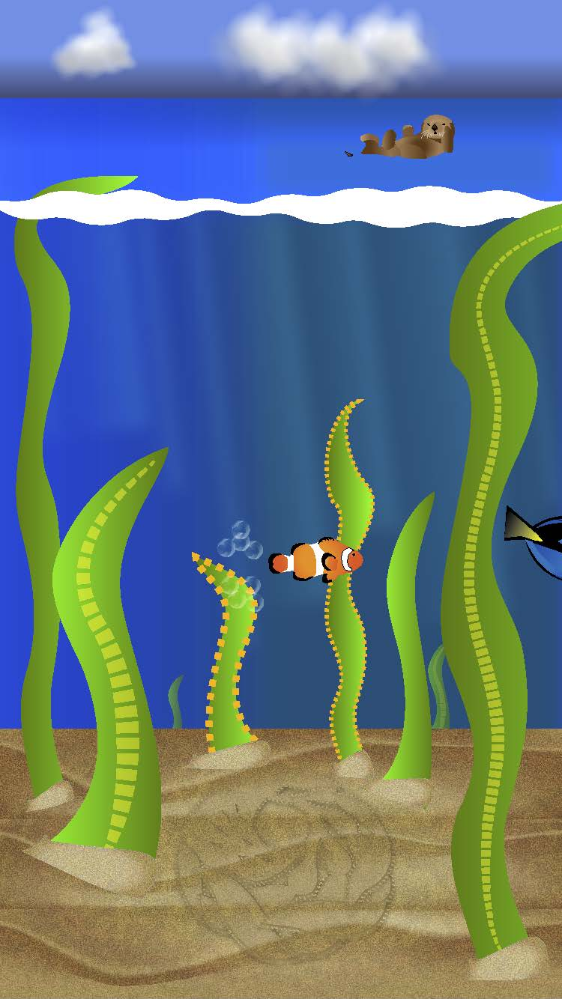
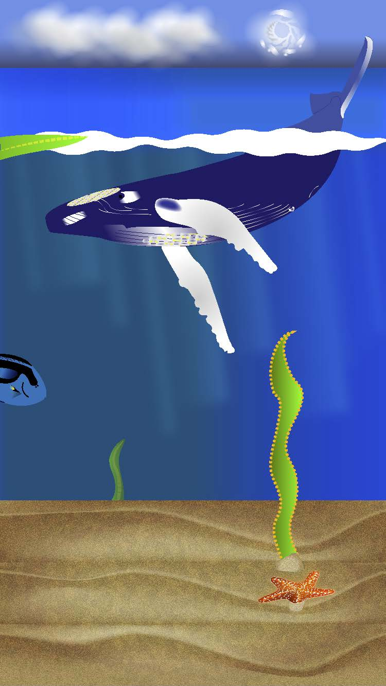
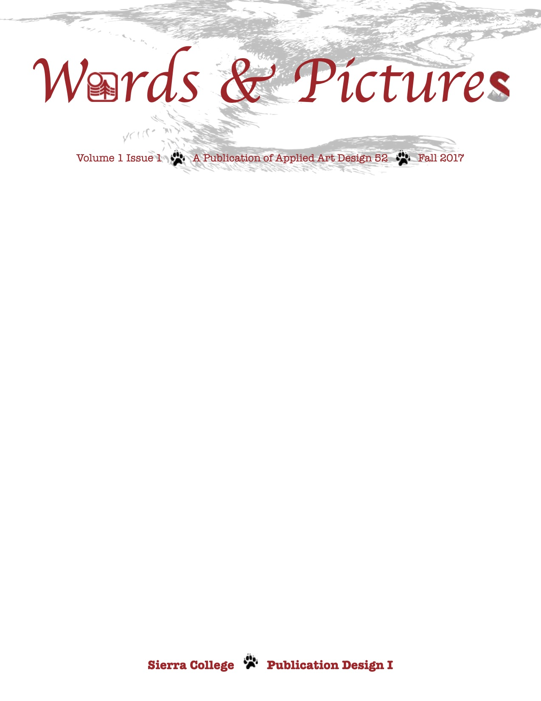
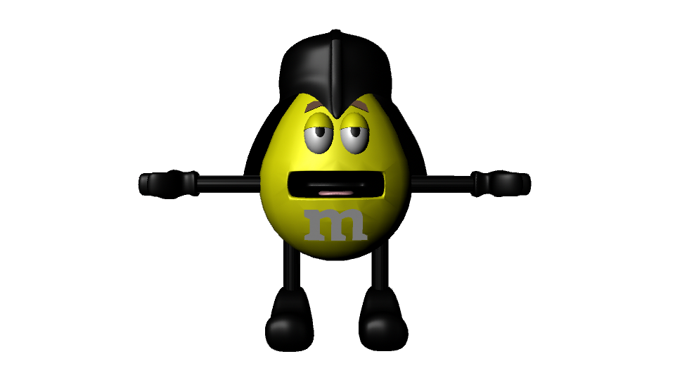

# Gallery

----------

Welcome to my gallery. Here, I have samples of projects I did in

- [Illustrator](#illustrator)
- [Photoshop](#photoshop)
- [InDesign](#indesign)
- [Maya](#maya)

I’ve organized my portfolio like a table of contents in a book. Each project is sectioned by the programs used to create each of the artworks. Each program used for the projects are linked to their specific section of the page. The reason for this order is to make navigating each page and the entire portfolio site user friendly.

I have chosen these particular pieces to demonstrate my skills as a graphic artist and an imaginative storyteller. Each of these pieces represents my creativity and attention to detail. My goals are to illustrate an idea or story and experiment with special effects. I have successfully accomplished these goals by creating artwork that sets up an idea or story and limiting any special effects so that it doesn't become the main focus of the piece.

The one thing I would like someone to notice about my portfolio is my attention to detail.

## Illustrator

----------

### App Screens 1 & 2

[Return to top](#gallery)

## Photoshop

----------

### Original

### Retouch

### Poster

[Return to top](#gallery)

## InDesign

----------

### Nameplate

[Return to top](#gallery)

## Maya

----------

### Darth Yellow 3D Model

[Return to top](#gallery)

----------

[About Me](./README.md)
