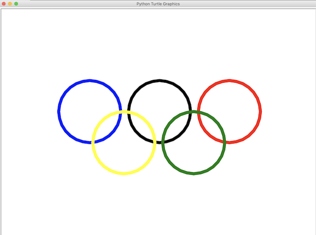

# Gallery

----------

I’ve organized my portfolio like a table of contents in a book and modeled the paths to the content after the directory standard used for file management with computers. Each project is sectioned into modules containing the topics that were explored for the unit. Each module and topic in the modules are linked to their specific section of the page. The reason for this order is to make navigating each page and the entire portfolio site user friendly. The paths of each topic can be followed the same way paths of a file can be followed on a computer to find its location.

The topics explored in this unit are:

- [Module 01](#module-01)
  * [Python Basics](#python-basics)
  * [Turtle](#turtle)
- [Module 02](#module-02)
  * [Calculation](#calculation)
- [Module 03](#module-03)
  * [Rock - Paper - Scissors - Lizard - Spock Game](#rock---paper---scissors---lizard---spock-game)
  * [Password Generator](#password-generator)
- [Module 04](#module-04)
  * [Collatz Sequence](#collatz-sequence)
  * [Comma Code](#comma-code)
  * [Character Picture Grid](#character-picture-grid)
- [Module 05](#module-05)
  * [Functions](#functions)
  * [Encryption/Decryption](#encryption/decryption)
- [Module 06](#module-06)
  * [Strings and Exception Handling](#strings-and-exception-handling)
  * [Password Manager Program](#password-manager-program)

I have chosen these particular pieces to demonstrate the progress I have made in learning the Python language. Each of these pieces represents how I started with learning the basics and how the different codes work and then advancing by applying what I have learned to create useful programs. My goals were to improve the skills I had already taught myself and to understand the language better. I have successfully accomplished these goals by following and understanding the examples in class and in the book *Automate The Boring Stuff With Python*. To explore my new skills further, I would also continue to use the book I was teaching myself from, *Beginning Python From Novice to Professional*, and research codes on the internet to find ways of enhancing my programs.

The one thing I would like someone to notice about my portfolio is that I don’t just accomplish what needs to be done, I continue to go beyond the lesson to learn more and continue to advance the skills I start out with. I think that once basic skills are mastered, the only way to keep these skills is by continually using them and finding new ways to advance them. I feel that this collection of work really reflects my abilities and what I have achieved so far. I came into this class with a little understanding of Python and some background in programming. This collection flows from starting with some simple basic skills, progresses by using those skills and exploring further how to add to them, and then combining multiple projects into one to result in a fully functioning program.

## Module 01

----------

### [Python Basics](https://github.com/gplambeck/unit_1/tree/master/module01/practices)

I selected these practices because they demonstrate how far I have come since the beginning of the semester. Practice 1 demonstrates storing a message in a variable and printing the message to the screen, and then changing the value of the variable and printing the new value to the screen. I created this by first naming my variable spam and assigning it the message as its value, then calling the print function on spam as seen here:

```python
spam = "Hello World!"
print(spam)
```

Practice 2 demonstrates how to print quotation marks to the screen. This is done by using **_escape quotes_**, single quotes enclosing the string.
```python
print('Obi-Wan Kenobi once said, "You\'ve taken your first step into \
a larger world."')
```
I also used (\\) to tell Python that the apostrophe is a character in the string and not the end of the string. In addition, I used the backslash by itself at the end of the line to tell Python that I want to break to the next line but to ignore the break when printing the string. This style is particularly important to me when writing code because text editors usually open as a small window. By confining my texts to a standard space, someone reading my code wouldn’t need to scroll to the side to read what is hidden at the side of the window or enlarge the window and fill their limited screen space.

Practice 3 demonstrates the importance of knowing the difference between an integer and a string. This is important because only strings can be concatenated. If the value of a variable is an integer and it is called upon in a string, the variable must be converted to a string using ```str(fave_num)``` before the variable can be concatenated in the string.

Practice 4 demonstrates the ```len()``` function which returns an integer value of the number of characters in a string.

Since most of the books I have read about Python start with these same basic practices, these practices relate to what I have learned before. I would like to remove this basics section from this collection because it doesn’t really reflect the full potential of my skills. This section just reflects the foundation of my later works. Starting here and progressing on shows how my projects progress and advance from the foundations I start with.

### [Turtle](https://github.com/gplambeck/unit_1/tree/master/module01/plambeck_hello_turtle.py)



I selected this piece of work because I have never typed instructions to the computer before to draw an image. Even though point, click, and drag are technically instructions to the computer, this is manually speaking to the computer in a language both I and the computer understand. I created this image by first making a variable called *my_turtle* to create a pen that will draw the circles. Then, I used *.circle()* to draw the circles of a radius I specify in the parentheses. I used *.backward()*, *.forward()*, and *.left()* to move my pen into the positions I specify in the parentheses to draw the circles at their locations shown above. I used *.up()* to lift the pen up and stop drawing to the screen when moving the pen and *.down()* to put the pen down and draw the circle. To change the color of the circles, I used *.color()* and specified the color in the parentheses. To make the code easy to follow, I grouped the codes by each ring color. Here is an example of how the blue ring was made:
```python
#Blue ring
my_turtle.up()              #lifts up the pen
my_turtle.backward(225)     #moves backward 225 without drawing
my_turtle.color('blue')	    #sets the color blue
my_turtle.down()            #puts the pen down
my_turtle.circle(100)       #draws a blue circle of radius 100
```
Learning how the numbers affect the forward and backward movements was particularly important to me during the process of creating this work. Having the correct amount of spacing between the circles was a problem I encountered when creating this image. To find the right amount of spacing, I did a lot of trial and error inputting the numbers. Once I saw the right amount of space between two circles, I calculated the rest of the movements based on this initial number. Doing these calculations relates to what I learned about movement on a graph in algebra and angles in trigonometry.

[Module 01 Files](https://github.com/gplambeck/unit_1/tree/master/module01)

[Return to top](#unit-1-fundamentals-of-programming-in-python)

## Module 02

----------

### [Calculation](https://github.com/gplambeck/unit_1/tree/master/module02/plambeck_how_many_trees.py)

I selected this piece of work to demonstrate how Python can be used to create a calculation program. The goal was to estimate the number of trees in Sacramento. First, I created a variable containing the area of Sacramento in square miles (sq. mi.). Then, I made five sample area variables each having a value of the number of trees in a sample area of 200 feet by 200 feet. Next, I made a variable that calculates the average number of trees. Then, I convert the sample area from sq. ft. to sq. mi. Finally, my *answer* variable calculates the average number of trees per sq. mi. sample area, multiplies by the area of Sacramento, and then is printed to the screen.

What was particularly important to me during the process of creating this work was the organization of how I was going to layout the calculation. I wanted to make sure I had all my information first and then do any calculations and conversions before making a final variable that would calculate the result. This way, if there was an error somewhere, I could find it in smaller set up calculations rather than search through one long line of code. In addition to formulas I learned in algebra, this also relates to the organization of procedures skills I learned in algebra.

[Module 02 Files](https://github.com/gplambeck/unit_1/tree/master/module02)

[Return to top](#unit-1-fundamentals-of-programming-in-python)

## Module 03

----------

### [Rock - Paper - Scissors - Lizard - Spock Game](https://github.com/gplambeck/unit_1/tree/master/module03/plambeck_rock-paper-scissors-lizard-Spock.py)

I selected this piece of work because Rock - Paper - Scissors is a good example of working with conditionals. The entire program relies on evaluating if a condition is met then do this else if the condition is not met then do something else. I decided to take the program a step further and code it to that popular game of Rock - Paper - Scissors - Lizard - Spock.

I created this game by first assigning a list of choices for the player and computer to choose from. To make sure that the player enters a valid input, I made a while loop that will compare the player’s input with the list and continue to loop until the player enters a choice from the list of choices. Then I set the conditions for winning with nested *if*, *elif*, and *else* statements.
```python
if p1 == p2:
    print('You tie!')
elif p1 == 'r':
    if p2 == 'p':
        print('You lose!')
    elif p2 == 's':
        print('You win!')
    elif p2 == 'l':
        print('You win!')
    else:
        print('You lose!')
elif p1 == 'p':
    if p2 == 'r':
        print('You win!')
    elif p2 == 's':
        print('You lose!')
    elif p2 == 'l':
        print('You lose!')
    else:
        print('You win!')
```
What was particularly important to me during the process of creating this game was finding a way to have the game continue until the player was done playing the game. I solved this by putting the game into a while loop and not ending the loop until the player chose not to play again. Another problem I encountered was trying to take care of invalid inputs. I solved this by having the values of the input variables compared to a list of choices and continuing to loop for a valid input until the values were in the list.

This piece of work relates to how I programed this game before in Java. With the exception of the language of the code being a little different, I basically wrote the code the exact same way and this time using what I have recently learned to add an option to continue or quit the game.


### [Password Generator](https://github.com/gplambeck/unit_1/tree/master/module03/plambeck_python_password_generator.py)

I selected the password generator because, in addition to the computer making a choice in the previous piece, it is a good example of how random items from a list can be chosen by the computer. To create this program, I first had to import random so that the computer could randomly pick items from a list. I then placed three lists and an original password variable above my main codes. To randomize four words to use in the new password, I assigned a random word from each of my list of words to four different variables.
```python
words = [nouns, verbs, adjs]
# Four random words from the list of nouns, verbs and adjs
word1 = random.choice(nouns)
word2 = random.choice(verbs)
word3 = random.choice(adjs)
word4 = random.choice(random.choice(words))
```
I then used *.capitalize()* to make the first letter in a word capitalized. Finally, I concatenated the four variables to create a new password.

Since this is a **password** generating program, it was important to me during the process of creating this work to learn how to use the *.replace(str1, str2, number of str to replace)* and *.capitalize()* methods to generate more secure passwords. I created a function using the *.replace()* method to replace the first specified number of occurrences of a letter in the password with a number or symbol.

A problem I encountered was in the challenge program. The program gives the computer 60 seconds to guess what the password is and displays the number of guesses after a user inputs a 4-character password composed only of lower-case letters. The problem was that the code I had to set the length of time for the program to run was not supported in the current version of Python. So, I searched the internet for a code that would be supported and found *time.time()*. This results the current time on the computer. By adding 60, I now have a variable with a value of 60 seconds.

This project relates to loops, conditions, and flow control statements learned for creating the previous game. Just like in the game, loops were used to keep the second program running until completed, conditions were evaluated whether to continue or not, and the flow control statements determined what action to take when a condition was met.

[Module 03 Files](https://github.com/gplambeck/unit_1/tree/master/module03)

[Return to top](#unit-1-fundamentals-of-programming-in-python)

## Module 04

----------

### [Collatz Sequence](https://github.com/gplambeck/unit_1/tree/master/module04/plambeck_collatz_sequence.py)

I selected this program to demonstrate how to define a function and how to use the *try* and *except* statements to validate the input. I created this program by first defining my function *collatz(number)*. If the number entered is even, divide it by 2 and print the result. If the number is odd, multiply it by 3 and add 1. After I have defined my function, I use the *try* statement in a while loop to try the user’s input and see if it is an integer and I use the *except* statement to print a message to the user to enter an integer if the program detects a value error. The while loop keeps calling on the *collatz(number)* function until the num variable equals 1.

What was particularly important to me during the process of creating this work was remembering to convert the value type of a returned variable to an integer so that the function could continue until the loop ended. This relates to what I learned before about string concatenation and operations on integers, the math operators will not work on strings.

### [Comma Code](https://github.com/gplambeck/unit_1/tree/master/module04/plambeck_comma_code.py)

I selected this function because it is a great example of how *end* disables a new line coming after the *print()* function and how to take a list value as an argument and returns a string with all the items separated by a comma and a space, with 'and' inserted before the last item. To create this function, I started with a for loop so that each item in the list, except the last item, gets printed. Then in the print function, I used *end* so that each item would print on the same line and be separated by a comma and a space. After the loop, I had the last item in the list printed after the ‘and’.

*end* was particularly important to me during the process of creating this function. It is good to know that I can loop the printing of strings and have them appear on the same line when working with lists.

This piece relates to what I learned before about how to create a function and why creating functions make coding easier. By creating a function, I only have to code an operation or procedure once and then call on it whenever I need to perform those functions.

### [Character Picture Grid](https://github.com/gplambeck/unit_1/tree/master/module04/plambeck_character_picture_grid.py)


The reason I selected this piece of work is because this function prints an ASCII image. The image is created by printing the items of each list that are stored in a list. To print the second image, shown above, I printed the image on paper and sketched a grid of each character that was needed for the image. I then used my grid to enter each item of each list and position the lists in the main list so that when the function was called the characters would print the resulting ASCII image.

Figuring out how to use a loop in a loop to print the items in the correct order was particularly important to me during the process of creating this work. This project was a good example of getting specific items from a specific index in a list. This applied what I had learned before about indexes. I basically used what I knew but had to look at calling on specific indexes in a particular way to get the items arranged to form a picture.
```python
# Function that prints an ASCII image
def ASCIIimage(gridName):
    for j in range(len(gridName[0])):
        print()
        for i in range(len(gridName)):
            print(gridName[i][j], end='')
    print()
```

[Module 04 Files](https://github.com/gplambeck/unit_1/tree/master/module04)

[Return to top](#unit-1-fundamentals-of-programming-in-python)

## Module 05

----------

### [Functions](https://github.com/gplambeck/unit_1/tree/master/module05/plambeck_functions_practice.py)

Again, I selected these practices because they demonstrate how my projects progress and advance from the foundations I start with. This would be another piece I would like to remove from this collection because it just reflects a simple introduction of what is to come. The *return* statement was particularly important to me during the process of these practices. It is important to specify what the return value of a function should be when defining your own function, especially if you want the function to return different values based on conditions. This would relate back to the Rock - Paper - Scissors game. There I had different print results based on certain conditions.

### [Encryption/Decryption](https://github.com/gplambeck/unit_1/tree/master/module05/plambeck_encryption_project.py)

I selected this piece of work because of all the items included, this one was the most challenging project. The problem I had was trying to figure out how I was going to get two lists, the alphabet list and the key list, to be associated with each other so the key would change the appropriate letters when scrambling the message. I created the function that would encrypt the message by first making three variables, one as an empty string, the second assigned the alphabet string variable, and the third assigned the key string variable. Then, I made a for loop that would loop through each symbol in the message. If the character in the message is in the alphabet, find its index in the alphabet and replace it with the character in the key with the same index. I also had to take care of characters that were in the message but not in the alphabet list, like the period, capital letters, numbers, or symbols. So, my *else* statement contained the empty string variable concatenated with the character not found in the alphabet list. To decrypt, I just swapped where the key and alphabet strings were used.
```python
# Translates the letters in the message to their corresponding replacement.
def translateMessage(Key, message, mode):
    translated = ''
    charsA = alphabet
    charsB = Key
    # For decrypting swap where the key and alphabet strings are used.
    if mode == 'd':
        charsA, charsB = charsB, charsA
    # loop through each symbol in the message
    for char in message:
        if char.lower() in charsA:
            charIndex = charsA.find(char.lower())
            translated += charsB[charIndex].lower()
        # if character is not in alphabet, just add it
        else:
            translated += char
    return translated
```

What was particularly important to me during the process of creating this work was putting the smaller parts together to make one program that would encrypt or decrypt depending on what the user wanted to do. This was a good example of how to break a large project down into sections and test and debug a little at a time before having one file of massive codes. This project relates to what I learned about loops, conditionals, and, most importantly, lists and their indexes.

The piece I would most like to improve is my *checkValidKey(Key)* function. Right now, if the user doesn’t input a key meeting the specified criteria, the program exits with an error message. Instead, I would like the function to loop until a valid key is entered. After trying all of the ways I have learned before about loops, I will come back to this and try some new ideas that I have learned in later lessons.


[Module 05 Files](https://github.com/gplambeck/unit_1/tree/master/module05)

[Return to top](#unit-1-fundamentals-of-programming-in-python)

## Module 06

----------

### [Strings and Exception Handling](https://github.com/gplambeck/unit_1/tree/master/module06/plambeck_practice.py)

Once again, I selected these practices because they demonstrate how my projects progress and advance from the foundations I start with. This would be another piece I would like to remove from this collection because it just reflects a simple introduction of what is to come. The *.split()* method was particularly important to me during the process of these practices. It is very useful for extracting parts of a string or reordering a string, like when formatting a person’s name. Another way of extracting parts of a string is by string slicing. This would relate back to using indexes in a list, except, this time the indexes refer to a character’s position in a string.

### [Password Manager Program](https://github.com/gplambeck/unit_1/tree/master/module06/plambeck_password_manager.py)

The password manager program is the piece in my portfolio I am most proud of because it is a useful full functioning program that contains a starting point with input from the user, options for the user to choose from, and an end when the user is done. What makes this my best piece is that I took everything I learned so far from the other projects in this portfolio and combined them into one large program, a final result of what I have learned.

To create this program, I first started with what I needed. I imported the modules I was going to need, then create the dictionaries, lists, and variable I was going to be using in my functions, and lastly, define the functions I was going to need to run the program. After my functions had been defined, I created a while loop that would ask the user for a username and password to access the program. Then I created another while loop that would keep the program running until the user was done. For this option I created a choice mode.
```python
# choosing mode
selection = ['e', 'd', 'a', 'r', 'g', 'x']
mode = input('Enter a menu selection (e, d, a, r, g, x): ')
mode = mode.lower()
while mode not in selection:
    mode = input('Enter a menu selection (e, d, a, r, g, x): ')
```
From here, I used the code from my previous projects and used *if*, *elif*, and *else* statements to run the appropriate code based on the user’s selection. Finally, I placed both exiting options at the end of my while loop.

The layout was particularly important to me during the process of creating this work. Because this file contains a lot of code, I wanted to have my functions grouped together at the top so that they are easier to find when reading through the while loop that runs the program. It could be easy to get lost in the code if I had my functions scattered in the middle of each mode. The functions are also listed in the order that they are used.

A problem I encountered was printing the encryption of the passwords in the *PASSWORDS* dictionary. I wanted the key and its value printed on the first line and then the encryption printed on the next line so the user knew what account the encrypted password went to. I solved this problem by making a for loop to first check if the key and its value were in the *PASSWORDS* dictionary. Then, if it is, print the key and its value as a string. Next, encrypt the password. Then, print the encryption.
```python
if mode == 'e':
    for k, v in PASSWORDS.items():
        print(k + ': ' + str(v))
        translated = encrypt(key, str(v))
        print('Enctrypted: ' + translated)
```
This project relates to everything covered in modules 1 through 6. The encryption/decryption of passwords followed the Encryption/Decryption project in Module 05, the adding and retrieving of passwords came from reading the lesson of dictionaries in the book *Automate The Boring Stuff*, and the password generator came from the Password Generator project from Module 03.

What makes this piece different from my weakest piece is that I can do more with the program. I can choose what I want to accomplish. I don’t have to make a choice to run the program to exit it, I can just exit the program right away. Also, I don’t have to keep running the program manually after it has finished completing a task, I can choose to do another task and exit the program when I am done. This program is also a more completed product, whereas the others are smaller portions that build up to this finished result.

[Module 06 Files](https://github.com/gplambeck/unit_1/tree/master/module06)

[Return to top](#unit-1-fundamentals-of-programming-in-python)


----------

[About Me](./README.md)
