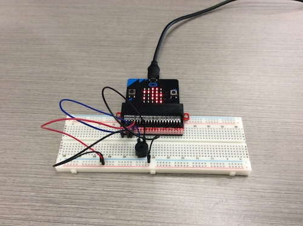

# Unit 2 Internet of Things (IoT)

----------

To keep my portfolio consistent with the other pages, I have organized this page with a directory layout. I also continue to use the Time Machine theme as seen on the About Me and Unit 1 pages. Keeping a portfolio consistent makes navigating through the site easier to follow.

The projects explored in this unit are:

* [Micro:bit Experiments](# micro:bit-experiments)
* [IoT Adventure](# iot-adventure)

[Unit 2 Files](https://github.com/gplambeck/unit_1/tree/master/module06)

I have chosen these particular pieces to demonstrate how Python can be used to make a device respond to particular input and become a useful tool. Doing each experiment helped me learn how to get the micro:bit to recognize button pushes or movements and how to get output results, like lights or sound, when these actions are done.

My goal was to learn how to connect the wires and components together to get the output results. I successfully accomplished this goal by carefully following the diagrams in the experiments and understanding what connections made the lights, buttons, and sound work.

The one thing I would like someone to notice about my portfolio is that I used what little resources I had to accomplish the project’s objectives. There were a lot of ideas to choose from, but I needed more resources to make them work and meet all the project’s objectives. So, I went back to the initial experiments in the unit and thought of what I can combine to meet all of the project’s objectives. I feel that this collection of work really reflects my abilities to use the resources I have and produce results. So far this year, I have achieved understanding the codes I read and how I can use them. Also, finding a use for components to create a device that meets all the project’s requirements.

## Micro:bit Experiments

----------

I selected this piece of work because each experiment is a great example of how to use an input like pushing a button or moving the micro:bit to make a light blink or make a servo motor move. Even though these are great examples to start with, I would want to remove this piece from my collection. It doesn’t really reflect what I can do. This piece of work was created by following diagrams and copying and pasting the given code to demonstrate what the code and wiring does. This was particularly important to me because I wanted to learn and understand how to correctly connect the wires and resistors to make each component work.

The problems I encountered was in Experiment 3 and Experiment 6. In Experiment 3, the photoresistor was supposed to sense when there was light in the room and turn the red LED light on when the sensor was covered. I couldn’t get the light to turn on when the sensor was covered. In Experiment 6, the LED light was supposed to change color with each button press and turn off after pressing the button for the fourth time. I could get the LED to change color, but I couldn’t get the LED to turn off. It would just keep changing color. I will have to keep working on these experiments to see if I can improve them so that they work the way they are supposed to.

These experiments relate to the understanding of loops, flow control, and conditions. For example:
```python
from microbit import *
import music

while True:
    if pin15.read_digital() == 1:
        music.play("C4:8")
    elif pin16.read_digital() == 1:
        music.play("D1:8")
    else:
        pass
```

[Return to top](#unit-2-internet-of-things-(iot))

## IoT Adventure

----------



I selected this piece of work because this is the piece I am most proud of. This project shows what I can do with a few pieces of components and create an interesting device. What makes this my strongest piece is that I was able to combine parts from multiple experiments to make a device that will play a tune when it is shaken or display a message when a button is pushed. These types of interaction are found in a lot of today’s simplest toys. What makes this project different from the experiments is that each experiment only does one task, while my devise can be used to interact with in two different ways. What made this project the hardest for me was trying to figure out what I could put together that would meet all of the project’s objectives. First, I thought about the output. I knew I was going to use the display so I thought about what my second output could be. I decided to use sound and make the sound random so that I could meet the list criteria. I had my display output take care of the concatenation criteria. Now, I had to figure out what kind of input they were going to need. I had already thought of using a button push to display a message. Then, I thought about the **_Bob It_** toy and decided to make my devise play a random melody when it was shaken. I looked back at the diagrams in the experiments to see how to wire the buzzer correctly. I made a list of the different melodies and a variable for each sentence in the message that was to be concatenated and displayed. Lastly, I created a function that would loop the operation that would activate based on the input.

What was important to me during the process of creating this work was understanding the code, how to tell the micro:bit what to do when shaken or when a button was pushed. A problem I encountered was trying to get the message to display when the A button was pressed. I solved this by finding the correct code to use to assign the condition to the A button.

In addition to using the experiments as a guide, this project related to what I learned before about lists and using a list to randomize output.

[Return to top](#unit-2-internet-of-things-(iot))


#### Course Units

----------

1. [Fundamentals of Programming in Python](./fundamentals_of_programming.md)
2. [**Internet of Things (IoT)**](./internet_of_things.md)
3. [Secure Scripting](./secure_scripting.md)
4. [Data Analytics](./data_analytics.md)
5. [Python Hackathon](./python_hackathon.md)

[About Me](./README.md)
